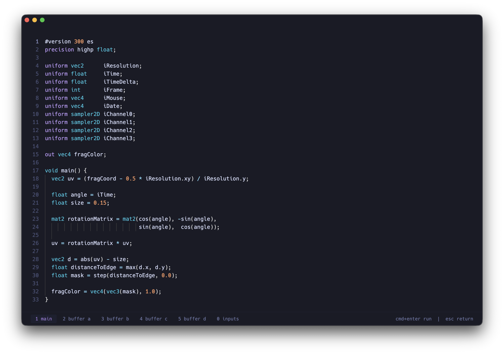

[](https://github.com/fapoli/shady)
[](./LICENSE)

# Shady

A minimal desktop shader editor for writing and running WebGL2 fragment shaders.

Shady is built around a quiet Monaco editor, a fullscreen preview, and Shadertoy-style uniforms/channels. It supports shader buffers, image and audio inputs, and live microphone audio-reactive textures.



## Features

- Frameless Electron app with a minimal dark interface
- Monaco editor with GLSL syntax highlighting
- WebGL2 fragment shader preview
- Multi-pass shader buffers
- Image, audio file, and microphone input channels
- Project save/load support
- Tokyo Night-inspired editor theme with a violet accent
- Global channels/buffers (main difference with shadertoy)

## Requirements

- Node.js
- npm

## Development

```bash
npm install
npm run dev
```

## Build

```bash
npm run build
```

To create a packaged app:

```bash
npm run package
```

Platform-specific packages:

```bash
npm run package:mac
npm run package:win
npm run package:linux
```

Release artifacts are written to `dist/`.

- macOS: DMG
- Windows: ZIP, x64
- Linux: tar.gz, x64

## Controls

- `Cmd+Enter` / `Ctrl+Enter`: run the shader preview
- `Space`: pause/resume the shader preview
- `Esc`: return to the editor
- `Cmd+Shift+F` / `Ctrl+Shift+F`: toggle stats
- `Cmd+0` / `Ctrl+0`: project
- `Cmd+1-5` / `Ctrl+1-5`: switch shader tabs

## Shader Notes

Shaders are WebGL2 fragment shaders and should start with:

```glsl
#version 300 es
```

Common uniforms include:

```glsl
uniform vec2 iResolution;
uniform float iTime;
uniform float iTimeDelta;
uniform int iFrame;
uniform vec4 iMouse;
uniform vec4 iDate;
uniform sampler2D iChannel0;
uniform sampler2D iChannel1;
uniform sampler2D iChannel2;
uniform sampler2D iChannel3;
```

Audio and microphone inputs use a `512 x 2` texture:

- row `0`: frequency data
- row `1`: waveform data

## Validation

```bash
npm run typecheck
npm run build
```

## License

MIT
